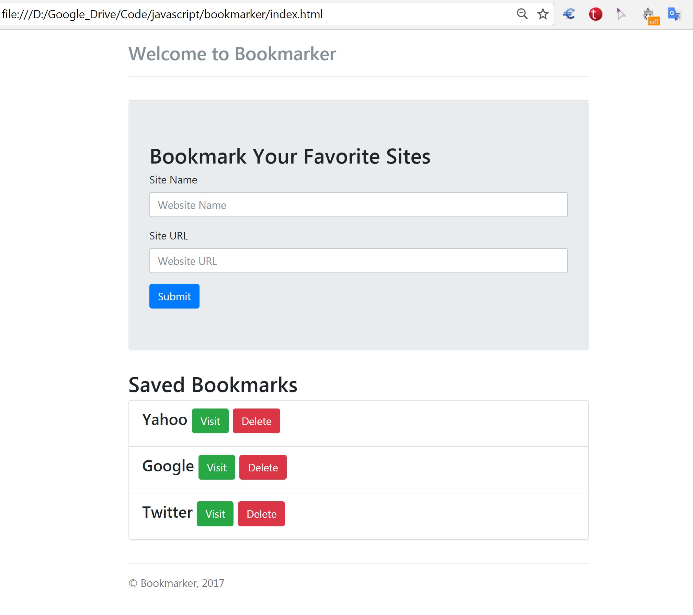

# Web Site Bookmarker

Educational, simple project for bookmarking web sites.

#### Using:  
- JavaScript ES6, HTML, CSS
- Bootstrap

#### Screenshot of app:  
<h1 align=center>
    
</h1>

#### Todos
    - Align visit, delete buttons to right
    - Visit button not working properly 
    - Use different save logic in order to modify local bookmarks 
      with json interface (without converting to js array and looping)

#### Note/References:  
- This project is slightly modified, refactored and ES6 version of https://github.com/bradtraversy/bookmarker.
- Learn JavaScript By Building A Bookmarker Application: 
  https://www.youtube.com/watch?v=DIVfDZZeGxM
